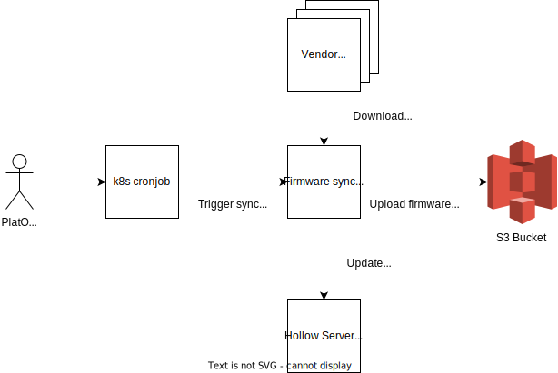

# Firmware Syncer

This service is responsible for downloading firmware files from vendor repositories, copying them over to a S3 bucket and populating the data in Hollow's [ServerService](https://github.com/metal-toolbox/hollow-serverservice)

## Diagram



## Usage

```
./firmware-syncer --config-file example-config.yml
```

Besides the configuration file, `firmware-syncer` requires the following environment variables set:
`S3_ACCESS_KEY`, `S3_SECRET_KEY`, `SYNCER_PUBLIC_KEY_FILE`, `SYNCER_PRIVATE_KEY_FILE`

## Development

TODO

## Deployment

TODO
